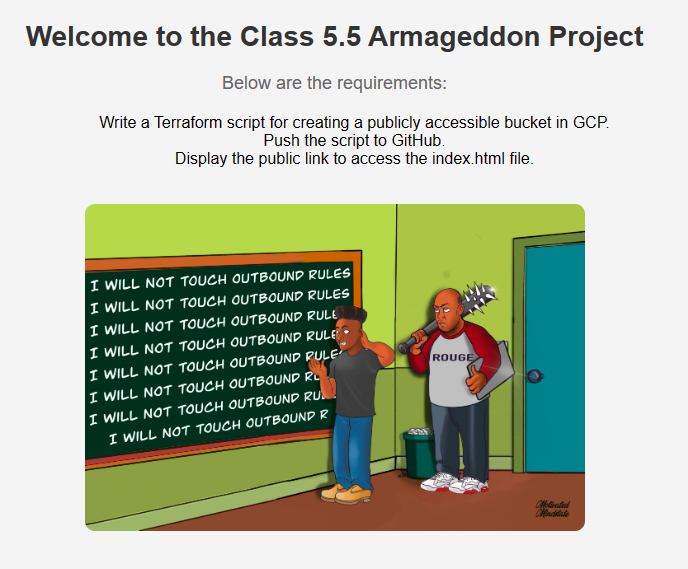
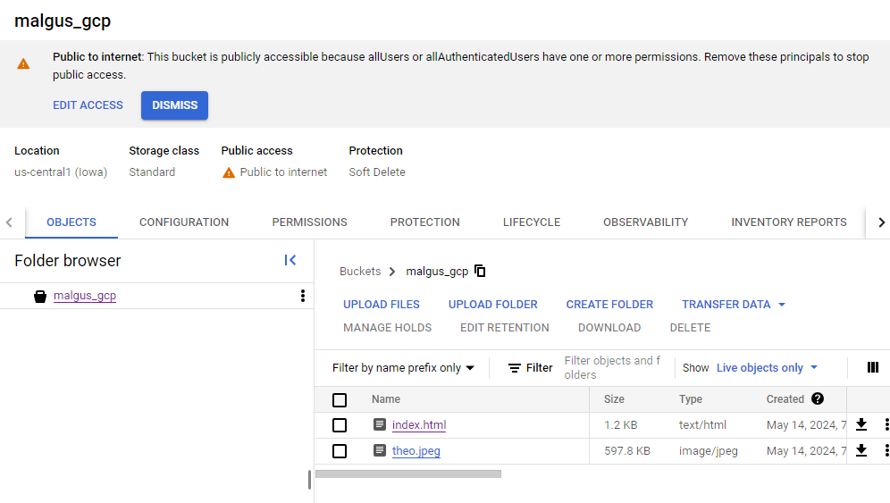
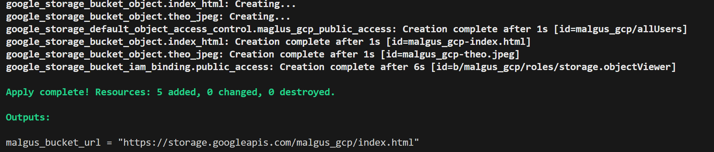

# Class 5 Project: Creating a Publicly Accessible Bucket in GCP with Terraform

## Requirements Summary:

This project aims to create a publicly accessible bucket in Google Cloud Platform (GCP) using Terraform. To successfully complete this project, you must accomplish the following tasks:

1. **Terraform Script:**
   Write a Terraform script that defines the configuration for the GCP bucket. This script should specify the bucket's name, storage class, location, website configuration, and any other necessary attributes.

2. **Git Push to GitHub:**
   Push your Terraform script to your GitHub repository. Ensure that your repository is appropriately named and organized for easy access and collaboration.

3. **Output File Showing Public Link:**
   Configure your Terraform script to output the public link of the bucket once it's created. This link should be easily accessible and identifiable for demonstration purposes.

4. **Include index.html File:**
   Include an `index.html` file within the bucket. This HTML file can be simple but should serve as the main page for the bucket's website. Ensure that the file is correctly referenced and accessible within the bucket.

## Instructions:

1. Clone this repository to your local machine.
2. Write the Terraform script according to the provided requirements.
3. Push your Terraform script to your GitHub repository.
4. Execute the Terraform script to create the GCP bucket.
5. Once the bucket is created, retrieve the public link and verify its accessibility.
6. Ensure that the `index.html` file is correctly placed within the bucket and accessible via the provided public link.
7. Update the README.md file with any additional instructions or insights.
8. Submit your project for evaluation.

## Additional Notes:

- Make sure to follow best practices for Terraform scripting and GitHub repository management.
- Keep your GitHub repository organized and well-documented for easy understanding and collaboration.
- Test the accessibility of the bucket and its contents to ensure that it meets the project requirements.
- Feel free to reach out for assistance or clarification on any aspect of the project.

