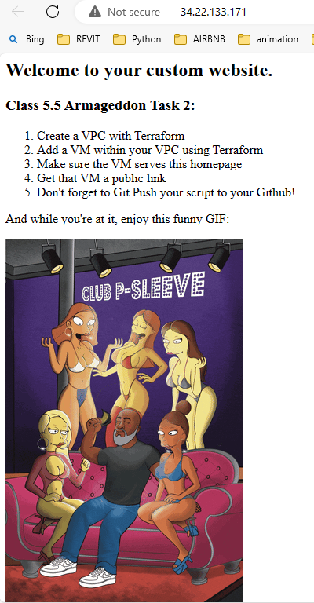
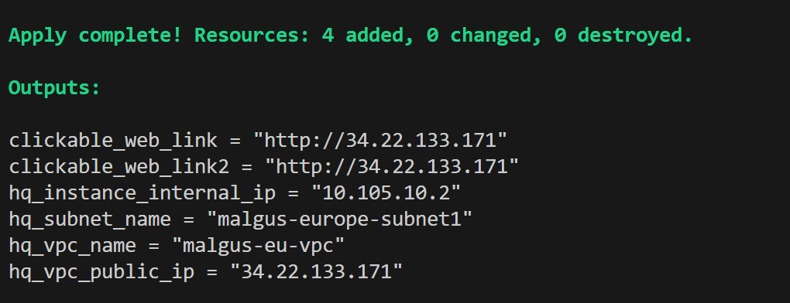
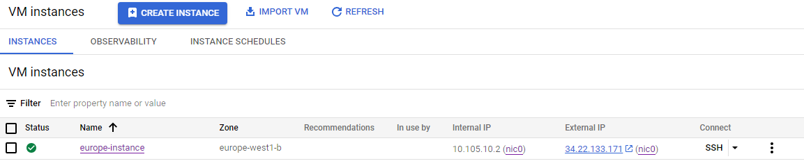

# Publicly Accessible Web Page with Terraform on Google Cloud Platform (GCP)

This Terraform script creates a publicly accessible web page on Google Cloud Platform by provisioning infrastructure with the following requirements:

1. Creates a Virtual Private Cloud (VPC).
2. Launches a Compute Engine instance within the VPC.
3. Configures the instance to serve a homepage.
4. Assigns an external IP to the instance, making it accessible via a public link.
5. Pushes the Terraform script to GitHub.
6. Outputs information including the External IP, VPC ID, Subnet ID of the instance, and Internal IP of the instance.

